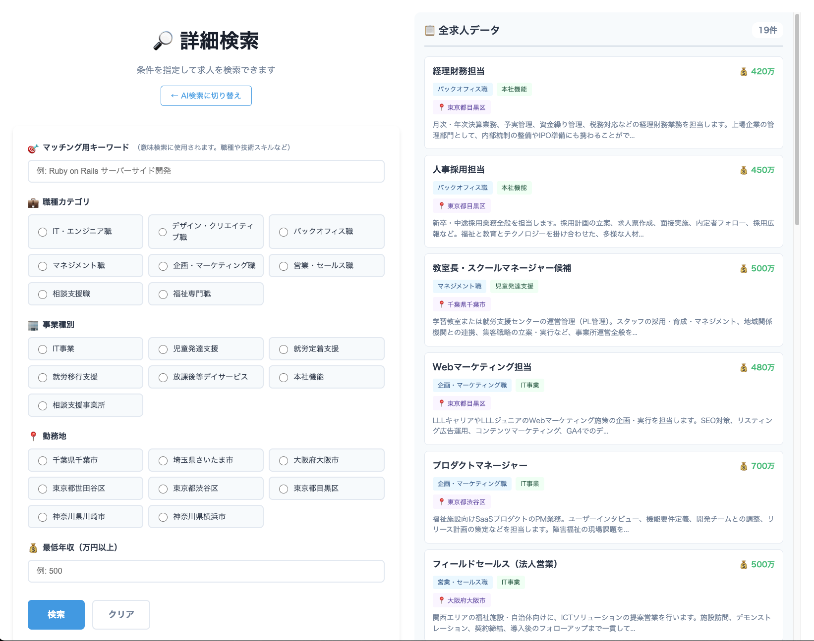

# README

## memo
- CLAUDE.md も見てください

## setup
- install
    - Ruby 3.4.0 (or see `.ruby-version` )
    - PostgreSQL (Client ライブラリが必要. 適当なバージョンで良さそう)
- OpenAI APIキーを作成する
    - `.env` ファイルに`OPENAI_API_KEY`として設定
    - `gpt-4o-mini` でOK ($5で十分)
- docker 環境

## 構築手順
- docker compose up
    - `docker compose up -d` など
    - DB のコンテナを起動する
- Rails のセットアップ
    - ```bash
      # 依存関係のインストール
      bundle install

      # データベースの作成とマイグレーション
      bin/rails db:create
      bin/rails db:migrate

      # テストデータの投入
      bin/rails import:jobs
      ```
    - `lib/tasks/import_jobs.rake` にテストデータが入ってます
- 開発サーバーの起動
    - `bin/rails server` または `bin/dev`

## 主な機能
### AI求人検索機能


- Google検索のように自然言語で、求人の条件や曖昧な希望を伝えることで、AI が検索条件を分解してくれる
    - 具体的な検索条件への分解・適用を行い、以下の「詳細検索」の検索条件・マッチング用キーワードに分解してくれる
    - RAGの一歩手前、検索結果についての回答をコンテンツ生成で行わず、求人一覧のUIで出す、みたいな感じ
- 画面右側は、登録されている全求人がプレビュー表示されます（詳細検索画面も同じ）

### 詳細検索（ベクトル検索）機能


- よくある求人検索機能（選択肢から条件を選んで絞り込む）に加え
- マッチング用キーワードによって、「ベクトル検索」を行う
  - 自然言語で曖昧な「こんな求人がみたい」という文章を入力して検索を行う
  - 単語よりも「どのような」というニュアンスを含んだ文章を指定するのが効果が大きい
- 検索条件は、一致するものをフィルタするよくある検索機能と同様の動きになる
- マッチング用キーワードは、入力した文章に「近い求人を優先としてソート」して検索する
  - 「子供といっしょに考えて一緒に成長できるような仕事がしたい」とすると、近いニュアンスのものを「マッチング度」によって取得
  - 「モダンなWeb開発をリモートワークでやれる仕事が良い」とすると、在宅OKな良さそうな開発環境でやれる求人を・・・、など

### AIの使い所
- まず、求人データを入れるときに「ベクトル化」している
  - 検索エンジン（この構成だと pg_vector を入れている）にベクトル化したデータを入れる
- マッチング用キーワードを受け取ったときに、検索実行前に「ベクトル化」する
  - 事前に求人データを登録するときにベクトル化しているのと同様。
  - この検索時のベクトルデータで、ベクトル検索を行う
- AI求人検索のときの「検索ワード」を分解するときにも利用
  - 求人検索条件、マッチング用キーワード に分解するために利用。（こっちはベクトル化よりもコストは増える）
